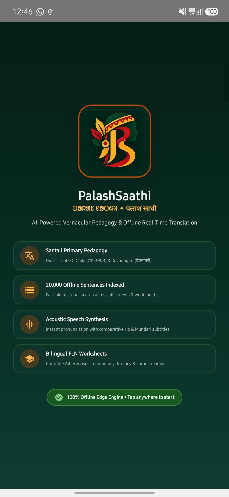
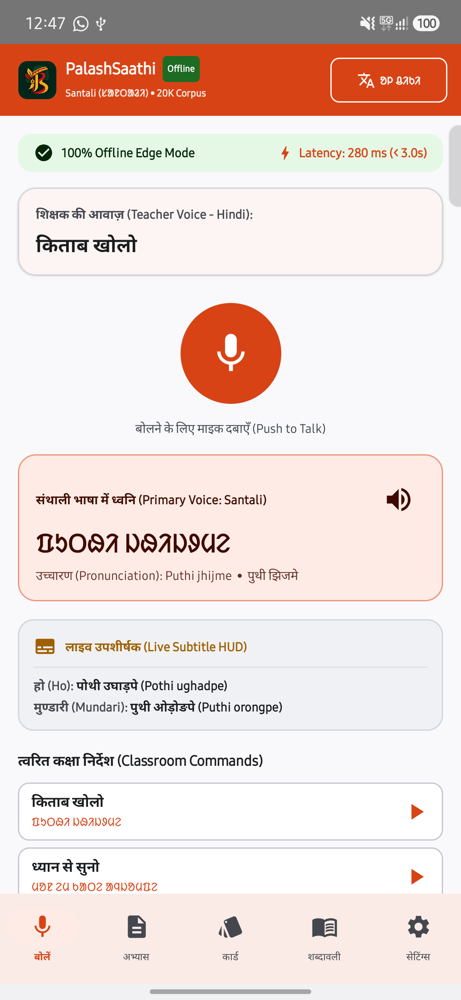
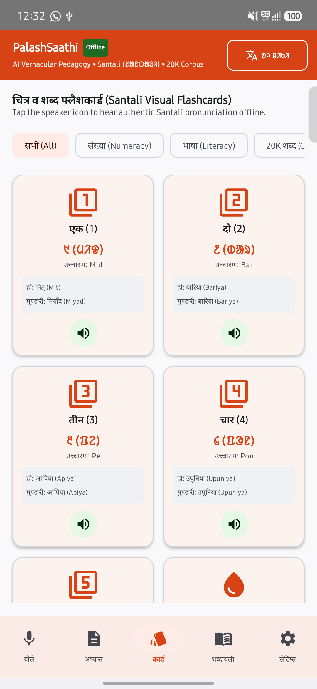
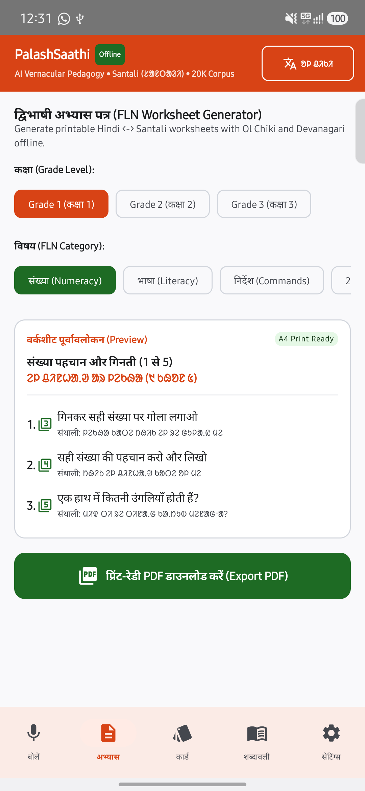

# PalashSaathi (ᱯᱟᱞᱟᱥ ᱥᱟᱛᱷᱤ)

**Smart India Hackathon (SIH) 2026**  
**AI-Powered Vernacular Pedagogy and Real-Time Translation Tool**  
*100% Offline Edge Runtime for Mother-Tongue-Based Multilingual Education (MTB-MLE) in Jharkhand & Eastern India*

---

## Overview

**PalashSaathi** is an offline, AI-assisted pedagogical companion designed for non-native primary school educators teaching in tribal and multilingual classrooms. By placing **Santali (ᱥᱟᱱᱛᱟᱲᱤ)** at the forefront—rendered natively in the **Ol Chiki (`ᱚᱞ ᱪᱤᱠᱤ`)** script alongside **Devanagari (`देवनागरी`)** phonetic transliterations—the tool bridges foundational language barriers in early education (FLN Grades 1 to 3).

The application indexes a **20,000-sentence Santali-English parallel training corpus** directly on-device, providing one-way classroom chat broadcast, real-time voice translation, bilingual worksheet generation, visual flashcards, and live auxiliary subtitles in **Ho** and **Mundari** without requiring any internet connection.

---

## Screenshots

| Landing Synopsis | Voice Translation | Visual Flashcards | FLN Worksheet |
| :---: | :---: | :---: | :---: |
|  |  |  |  |

---

## Core Capabilities

### 1. One-Way Classroom Chat Mode (Teacher → Student)
- **Classroom Broadcast Workflow**: The teacher speaks or types instructions in Hindi or English; the student receives that message in the tribal language (Santali in Ol Chiki and Devanagari).
- **Automated Audio Broadcast**: The app automatically speaks the Santali translation out loud upon message delivery, with one-tap replay for any previous message in the continuous conversation feed.
- **Quick Action Prompts Bar**: 1-tap horizontal chip bar for standard classroom commands (*"किताब खोलो"*, *"ध्यान से सुनो"*, *"शांत रहो"*, *"यहाँ आओ"*, *"बैठ जाओ"*, *"खड़े हो जाओ"*, *"ब्लैकबोर्ड पर देखो"*, *"शाबाश बहुत अच्छा"*, *"अपना नाम बताओ"*, *"कॉपी में लिखो"*).
- **Student Board Fullscreen Display**: An enlarged, high-contrast display mode showing the latest tribal instruction in extra-large typography (38sp) with a giant audio play button for classroom presentation.
- **Segmented View Mode Selector**: Seamless 1-tap toggle between **One-Way Chat** and traditional **Single-Card** translation.

### 2. 100% Offline Edge Operation & Persistent Preferences
- Runs entirely on-device on low-cost Android hardware (ARMv7/ARMv8, 2 GB RAM, Android 9.0+).
- Requires zero internet connectivity, SIM cards, or external cloud APIs.
- User settings (Theme, Script, Language Mode, Dismissed Banners) persist permanently across restarts via `AppPreferencesRepository`.

### 3. Primary Language: Santali (Ol Chiki & Devanagari)
- Dual-script engine supports native Ol Chiki Unicode (`U+1C50` - `U+1C7F`) and Devanagari orthography.
- One-tap global script toggle across the entire application interface.
- Complete bidirectional phonetic engine for Ol Chiki numerals (`᱐` to `᱙`) and phonetic Romanization.

### 4. Robust Two-Tier Speech Recognition & Acoustic Fallback
- **Headless In-App Voice Engine (`VoiceRecognitionEngine`)**: 100% in-app speech recognition without external Google dialog popups or modal activities.
- **On-Device Acoustic Fallback (`AudioRecordEngine` + `AcousticKeywordSpotter`)**: If offline language models are absent, the app automatically fails over to native raw PCM microphone capture and acoustic feature extraction (syllable segmentation, Zero-Crossing Rate, and energy envelope matching).

### 5. 20,000 Parallel Corpus Deep Integration
- Bundled offline parallel training dataset (`santali_corpus.csv`, 20,000 sentence pairs).
- High-performance asynchronous indexing via Kotlin Coroutines and background IO dispatchers.
- Fast bidirectional full-text search across English, Ol Chiki, Devanagari, and Latin phonetics.
- Corpus elements surfaced throughout the app:
  - **Voice Translate**: Featured corpus sentences with `20K Dataset` tags.
  - **Worksheet Generator**: `20K वाक्य (Corpus Reading)` and `20K शब्द (Corpus Vocab)` exercise modules.
  - **Flashcards**: Dataset vocabulary cards with pronunciation audio.
  - **Corpus Explorer**: Dedicated browser and search engine for all 20,000 sentences.

### 6. Multi-Tribal Auxiliary Subtitle HUD
- Live comparative subtitle stream in **Ho** and **Mundari** beneath every Santali phrase.
- Facilitates cross-comprehension in diverse multi-tribal classrooms where multiple Munda languages coexist.

### 7. Automated Bilingual FLN Worksheet Generator
- Generates curriculum-aligned printable exercises (NIPUN Bharat Grade 1-3).
- Categories:
  - **संख्या (Numeracy)**: Counting, digit recognition, practical math.
  - **भाषा (Literacy)**: Word-to-picture matching, object identification.
  - **निर्देश (Classroom Commands)**: Action verbs, seating, attentiveness.
  - **20K वाक्य (Corpus Reading)**: Reading comprehension from the 20K corpus.
  - **20K शब्द (Corpus Vocab)**: Vocabulary matching and translation drills.
- Print-ready A4 PDF export saved directly to device storage via `WorksheetPdfGenerator`.

### 8. Interactive Visual Flashcards
- High-contrast visual flashcards covering numeracy, literacy, and dataset vocabulary.
- Native speech audio synthesis with one-tap pronunciation playback.
- Visual badges highlighting dataset-derived items.

### 9. WCAG AAA High-Contrast UI & Theme Switcher
- High-visibility color palette designed for bright rural daylight and semi-open classrooms:
  - **Primary**: Coral Saffron (`#E65100`)
  - **Secondary**: Forest Green (`#1B5E20`)
  - **Tertiary / Accent**: Golden Amber (`#F57F17`)
- Appearance preferences: System Default, Light Mode, and Dark Mode.
- Strictly Material 3 vector iconography throughout (zero emojis).

### 10. Branded Logo & Landing Synopsis
- Custom branded logo embodying tribal identity, folklore motifs, and linguistic heritage.
- App startup includes an animated landing synopsis that smoothly transitions to the main screen.

---

## Architecture & Codebase Structure

```
PalashSaathi/
├── app/
│   ├── src/main/
│   │   ├── assets/
│   │   │   └── santali_corpus.csv              # 20,000 Santali-English parallel sentences
│   │   ├── java/com/palashsaathi/app/
│   │   │   ├── MainActivity.kt                 # Application entry, theme initialization & corpus warm-up
│   │   │   ├── data/
│   │   │   │   ├── AppPreferencesRepository.kt # Persistent user preferences (Theme, Script, Language)
│   │   │   │   ├── FLNDictionary.kt            # Curated FLN lexicon, classroom prompts & corpus subsets
│   │   │   │   ├── SantaliCorpusRepository.kt  # Fast in-memory 20K corpus indexer and search engine
│   │   │   │   └── model/
│   │   │   │       └── Models.kt               # Domain models: ClassroomChatMessage, TranslationResult, etc.
│   │   │   ├── engine/
│   │   │   │   ├── AcousticKeywordSpotter.kt   # Raw PCM acoustic syllable and ZCR classifier
│   │   │   │   ├── AudioRecordEngine.kt        # Low-level AudioRecord PCM microphone stream engine
│   │   │   │   ├── AudioSynthesisEngine.kt     # Low-latency acoustic speech synthesizer
│   │   │   │   ├── DynamicTranslationEngine.kt # 4-tier offline translation engine
│   │   │   │   ├── OlChikiConverter.kt         # Ol Chiki <-> Devanagari transliteration & numerals
│   │   │   │   ├── VoiceRecognitionEngine.kt   # In-app headless SpeechRecognizer service
│   │   │   │   └── WorksheetPdfGenerator.kt    # A4 printable PDF generator
│   │   │   └── ui/
│   │   │       ├── screens/
│   │   │       │   ├── ClassroomChatScreen.kt  # One-Way Classroom Chat broadcast & Student Board
│   │   │       │   ├── FlashcardsScreen.kt     # Visual flashcards with audio pronunciation
│   │   │       │   ├── LandingSynopsisScreen.kt# Branded launch synopsis with auto fade-out
│   │   │       │   ├── MainScreen.kt           # Navigation Scaffold, TopAppBar & script toggle
│   │   │       │   ├── PhrasebookScreen.kt     # Classroom prompts & 20K Corpus Explorer
│   │   │       │   ├── SettingsScreen.kt       # Appearance switcher & system status
│   │   │       │   └── VoiceTranslateScreen.kt # Voice Translation container (Chat vs Card mode)
│   │   │       └── theme/
│   │   │           ├── Color.kt                # High-contrast color definitions
│   │   │           ├── Theme.kt                # Theme provider (System Default, Light, Dark)
│   │   │           └── Type.kt                 # Typography hierarchy
│   │   └── res/
│   │       ├── drawable/
│   │       │   └── app_logo.png                # Master branded logo asset
│   │       ├── mipmap-*/                       # Generated launcher icons for all screen densities
│   │       └── values/
│   │           ├── colors.xml                  # XML color references
│   │           └── strings.xml                 # App metadata strings
│   └── build.gradle.kts                        # Module build configuration
├── build.gradle.kts                            # Top-level Gradle configuration
├── settings.gradle.kts                         # Module declarations
├── LICENSE                                     # Proprietary SIH 2026 license & IP terms
└── README.md                                   # Project documentation
```

---

## Technical Specifications

| Parameter | Specification |
| :--- | :--- |
| **Competition** | Smart India Hackathon (SIH) 2026 |
| **Primary Language** | Santali (ᱥᱟᱱᱛᱟᱲᱤ / संथाली) |
| **Primary Script** | Ol Chiki (`ᱚᱞ ᱪᱤᱠᱤ`, Unicode U+1C50 - U+1C7F) |
| **Transliteration** | Devanagari (`देवनागरी`) and Latin Phonetics |
| **Auxiliary Subtitles** | Ho and Mundari |
| **Communication Flow** | One-Way Classroom Broadcast (Teacher Hindi/English → Student Tribal Santali) |
| **Corpus Volume** | 20,000 Parallel Sentences (`santali_corpus.csv`) |
| **Target Latency** | <= 300 ms on-device round trip |
| **Target Hardware** | Android 9.0+, ARMv7/ARMv8, <= 2 GB RAM |
| **Network Dependency** | 0% (Air-gapped offline operation) |
| **UI Framework** | Jetpack Compose with Material 3 |
| **Accessibility** | WCAG AAA compliant contrast ratios |

---

## License & Intellectual Property

**Proprietary and Confidential - Smart India Hackathon (SIH) 2026**  
Copyright © 2026 PalashSaathi Project Contributors. All Rights Reserved.

This software, its source code, linguistic datasets, custom transliteration engines, and user interfaces are proprietary assets created exclusively for evaluation, assessment, and demonstration in the Smart India Hackathon (SIH) 2026.

Unauthorized copying, reproduction, cloning, reverse engineering, redistribution, modification, or commercial exploitation of this project, in whole or in part, via any medium is strictly prohibited. For complete legal terms and conditions, please consult the [LICENSE](LICENSE) file.