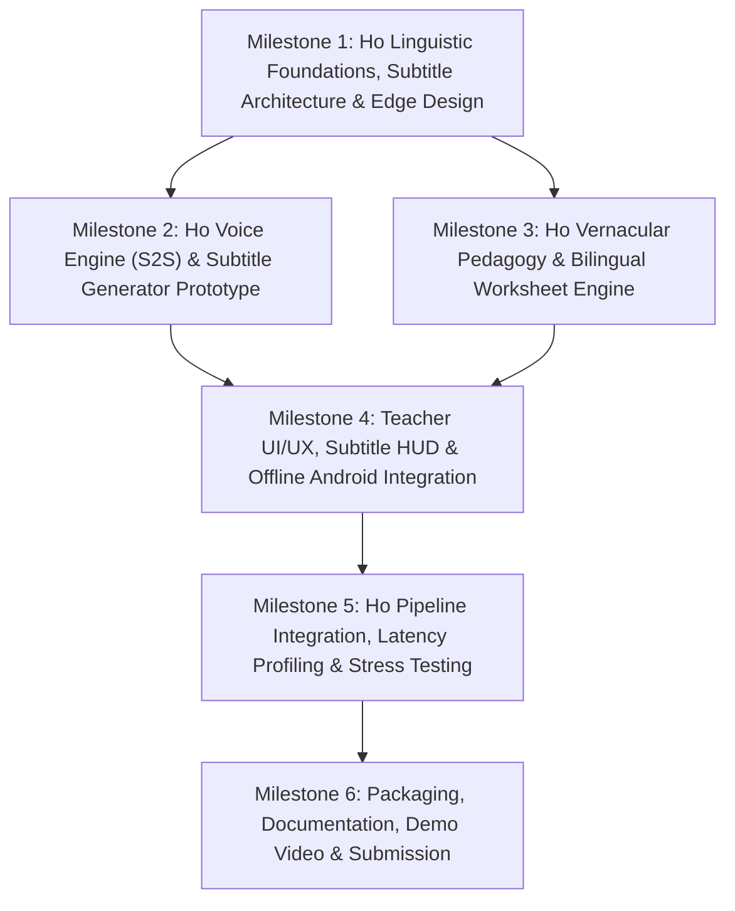

# PalashSaathi: Product Development Roadmap (ROADMAP.md)

**Project:** AI-Powered Vernacular Pedagogy and Real-Time Translation Tool  
**Primary Language (Full Voice & Pedagogy):** **Santali** (Ol Chiki script and Devanagari transliteration; 20K training corpus)  
**Auxiliary Languages (Live Subtitles Only):** **Ho** and **Mundari** (Text subtitles for classroom cross-comprehension)  
**Core Mission:** Empower non-native primary school teachers to deliver Mother-Tongue-Based Multilingual Education (MTB-MLE) and Foundational Literacy and Numeracy (FLN) instruction primarily in **Santali**, featuring real-time speech translation (< 3s latency), 20,000-sentence offline parallel corpus explorer, auto-generated bilingual worksheets, and supplementary subtitle streams for Ho and Mundari on low-end Android tablets offline.

---

## Executive Summary & Deliverables Matrix

| Metric / Deliverable | Target Specification | Scope Focus | Target Milestone |
| :--- | :--- | :--- | :--- |
| **Primary Speech Pipeline** | Hindi -> Santali (Full Speech-to-Speech: ASR -> MT -> TTS) | Full Voice & Audio | Milestone 1, 2, 5 |
| **Auxiliary Subtitle Tracks** | Real-time text subtitles in Ho & Mundari | Subtitles Only (Text) | Milestone 1, 2, 4 |
| **Voice-to-Voice Latency** | <= 3.0 seconds total round-trip for Hindi -> Santali audio | Primary Audio Stream | Milestone 2, 5 |
| **Classroom Pedagogy** | Auto-generated Hindi <-> Santali bilingual worksheets & flashcards (FLN Grade 1-3) | Primary Pedagogy | Milestone 3 |
| **Script Support** | Ol Chiki Unicode rendering + Devanagari phonetic transliteration | Santali Orthography | Milestone 1, 3, 4 |
| **Corpus Integration** | 20,000-sentence Santali-English offline parallel corpus search & dictionary | Offline Dataset | Milestone 1, 3, 4 |
| **Hardware Target** | Low-end Android tablet (<= 2 GB RAM, ARMv7/v8, zero internet) | Edge Runtime | Milestone 4, 5 |
| **Offline Reliability** | 100% offline functionality for inference, font rendering, and exports | Air-Gapped Operation | Milestone 4, 5 |
| **Submission Assets** | Runnable APK / PWA bundle, Technical Docs, Teacher Guide, Demo Video | Delivery Package | Milestone 6 |

---

## Roadmap Structure Overview

---

## Milestone 1: Ho Linguistic Foundations, Subtitle Architecture & Edge Design

> **Objective:** Build the linguistic foundation and font stack for the Ho language, design the sub-3-second speech-to-speech pipeline for Ho, establish lightweight text translation pathways for Santhali and Mundari subtitles, and architect an offline edge runtime.

### Submilestone 1.1: Ho Linguistic Corpora & Font Stack Integration
- [ ] **Ho Linguistic Audit:** Consolidate open-source parallel corpora and dictionaries for Ho (e.g., AI4Bharat IndicTrans2, Bhashini, NLLB-200 `hoc_Deva`/`hoc_Latn`, and regional Jharkhand tribal lexicons).
- [ ] **Warang Citi Font & Script Engine:**
  - Package open-license Warang Citi Unicode fonts (e.g., Noto Sans Warang Citi) to prevent missing glyphs ("tofu") on legacy Android OS.
  - Implement a bi-directional transliteration module between Warang Citi script and Devanagari phonetic script.
- [ ] **Ho FLN Vocabulary Corpus:** Compile a verified 500-word Foundational Literacy and Numeracy (FLN) lexicon in Ho (numbers 1-100, basic math verbs, body parts, animals, domestic objects, teacher commands).
- [ ] **Auxiliary Subtitle Lexicon Setup:** Create lightweight lookup tables and tokenizers for Santhali and Mundari to serve fast text-only subtitle generation.

### Submilestone 1.2: Low-Latency Audio Pipeline & Subtitle HUD Architecture
- [ ] **Ho Audio Latency Budget Allocation:** Strict end-to-end timing budget for sub-3-second round-trip:
  - Voice Activity Detection (VAD) & Audio Streaming: <= 200 ms
  - Automated Speech Recognition (Hindi ASR): <= 900 ms
  - Machine Translation (Hindi -> Ho): <= 700 ms
  - Text-to-Speech Synthesis (Ho TTS): <= 900 ms
  - Audio Buffer & Output Playback: <= 300 ms
- [ ] **Concurrent Subtitle Stream Architecture:** Decouple the secondary Santhali and Mundari text subtitle generators to run asynchronously in background worker threads without blocking the critical Ho audio path.

### Submilestone 1.3: Offline-First Tablet Edge Architecture
- [ ] **Edge Runtime Selection:** Benchmark on-device inference runtimes (ONNX Runtime Mobile / TFLite / Sherpa-ONNX) optimized for 32-bit/64-bit ARM processors.
- [ ] **Component Interface Specification:** Define strict API boundaries between the Hindi Speech Ingestion, Ho Speech Output, Subtitle Display Manager, and Worksheet Generator.
- [ ] **Offline Fallback Protocol:** Design a pure zero-network architecture: bundled local quantized models with instant dictionary fallback when neural inference is strained.

---

## Milestone 2: Ho Voice Engine (S2S) & Subtitle Generator Prototype

> **Objective:** Build the working Hindi-to-Ho speech-to-speech translation pipeline achieving sub-3-second round-trip latency, while producing simultaneous text subtitle streams for Santhali and Mundari.

### Submilestone 2.1: Machine Translation & Subtitle Generation Engine
- [ ] **Hindi -> Ho Neural Translation:** Deploy a compact, quantized neural translation model fine-tuned for Hindi to Ho translation (e.g., distilled IndicTrans2 or quantized NLLB).
- [ ] **Rapid FLN Cache:** Build an in-memory key-value dictionary for high-frequency classroom commands (< 15 ms response time).
- [ ] **Auxiliary Subtitle Engine:** Implement lightweight translation heads for generating synchronous text subtitles in Santhali (Ol Chiki / Devanagari) and Mundari (Devanagari).

### Submilestone 2.2: Hindi-to-Ho Speech-to-Speech (S2S) Pipeline
- [ ] **Hindi Streaming ASR:** Implement a fast, quantized Hindi speech recognition model (e.g., Whisper-Tiny INT8, Sherpa-ONNX Hindi model, or IndicConformer CTC) with chunked audio streaming.
- [ ] **Ho Text-to-Speech (TTS) Synthesizer:**
  - Implement a lightweight acoustic model and vocoder (e.g., Piper TTS / quantized VITS / eSpeak-NG with phonetic rules for Ho).
  - Train/adapt the voice model to produce clear, child-friendly Ho pronunciation for primary school classroom instruction.
- [ ] **Audio Pipeline Integration:** Stream audio chunks through ASR -> Ho MT -> Ho TTS without writing intermediate WAV files to disk, drastically cutting I/O latency.

### Submilestone 2.3: Model Quantization & Memory Footprint Optimization
- [ ] **INT8 Quantization:** Quantize Hindi ASR, Ho MT, and Ho TTS models to 8-bit precision (INT8/W8A8) to keep active memory consumption under 1 GB RAM.
- [ ] **Binary Size Reduction:** Strip unused language vocabularies and heads, keeping the combined offline model package under 450 MB.

---

## Milestone 3: Ho Vernacular Pedagogy & Bilingual Worksheet Generator

> **Objective:** Build an automated curriculum generation engine that translates standard Hindi FLN curricula into structured, printable bilingual worksheets and visual flashcards specifically in the Ho language.

### Submilestone 3.1: Ho FLN Curriculum Templates & Pedagogical Content
- [ ] **Grade 1-3 Ho Curriculum Schemas:** Define structured JSON templates aligned with standard NIPUN Bharat FLN learning outcomes:
  - Ho Numeracy: Counting (1-20, 1-100), simple additions, subtraction, geometric shapes, and practical counting.
  - Ho Literacy: Phonetics, letter identification in Warang Citi and Devanagari, object naming, rhyming, and simple sentences.
- [ ] **Teacher Ho Classroom Phrasebook:** Curate 100+ standard pedagogical prompts in Ho with native audio playback (e.g., "Kitab kholo" -> "Pothi ughadpe", "Dhyan se suno" -> "Sangi te aayumpe").

### Submilestone 3.2: Automated Hindi-Ho Bilingual Worksheet Generator
- [ ] **Dual-Column & Dual-Script Layout Engine:** Build an automated PDF/print generator pairing Hindi instructions side-by-side with Ho (in both Warang Citi script and Devanagari phonetic script).
- [ ] **Modular Exercise Types:**
  - Match-the-following (Hindi word <-> Ho word in Warang Citi <-> Illustration).
  - Fill-in-the-blanks with visual clues.
  - Warang Citi character tracing and handwriting practice sheets.
- [ ] **Printable Black-and-White PDF Exporter:** Produce high-contrast, ink-saving A4 printable sheets suitable for low-cost monochrome school printers.

### Submilestone 3.3: Interactive Visual Flashcards with Audio
- [ ] **Curated Offline Vector Asset Library:** Bundle 200+ offline SVG/PNG illustrations (animals, plants, classroom items, agricultural tools familiar in the Kolhan region).
- [ ] **Interactive Digital Flashcards:** Render digital cards in the tablet UI featuring the illustration, Hindi term, Ho word (Warang Citi + Devanagari), and a one-tap Ho pronunciation button.
- [ ] **Subtitle Reference Bar:** Include small subtitle chips on flashcards showing the corresponding Santhali and Mundari terms for teacher reference.

---

## Milestone 4: Teacher UI/UX, Subtitle HUD & Offline Android Integration

> **Objective:** Deliver an ergonomic, high-contrast user interface tailored for non-native speaking teachers in rural schools, featuring one-tap voice translation in Ho, live multi-tribal subtitles, and low-end Android tablet compatibility.

### Submilestone 4.1: Classroom-Optimized Touch UI & Subtitle HUD
- [ ] **High-Contrast, Tactile UI:** Design high-visibility layouts with large touch targets (>= 48 dp) readable in bright outdoor/semi-open classroom lighting.
- [ ] **One-Tap Push-to-Talk (PTT) Button:** Prominent voice capture button with instant visual status feedback (Listening -> Translating -> Speaking Ho).
- [ ] **Live Subtitle HUD (Heads-Up Display):**
  - Primary Display: Real-time Hindi transcript + Ho translated speech with dual-script toggle (Warang Citi / Devanagari).
  - Subtitle Strip: Clean, persistent lower-third subtitle bar displaying synchronized translations in **Santhali** and **Mundari**.
- [ ] **Script Toggle:** Quick one-touch switch between Warang Citi script and Devanagari script for Ho text display.

### Submilestone 4.2: Low-End Android Tablet Optimization
- [ ] **Strict Memory Cap (<= 1.5 GB):** Enforce strict application RAM limits to ensure zero out-of-memory (OOM) crashes on 2 GB RAM Android hardware.
- [ ] **Battery & CPU Throttling Protection:** Implement non-polling microphone listeners, sleep modes during idle periods, and light wake-locks during active translation.
- [ ] **Cold-Start Optimization:** Ensure application cold-start time is < 3.0 seconds by lazy-loading secondary subtitle models and visual assets.

### Submilestone 4.3: Local Storage & Zero-Network Persistence
- [ ] **Embedded Database (SQLite / Room):** Store saved worksheets, favorite phrases, custom vocabulary entries, and translation logs locally.
- [ ] **Air-Gap Verification:** Complete verification that all app features (voice translation, worksheet export, audio playback) execute without network hardware or SIM connectivity.

---

## Milestone 5: Ho Pipeline Integration, Latency Profiling & Stress Testing

> **Objective:** Integrate all software components, benchmark round-trip voice latency against the sub-3-second threshold, and validate the linguistic authenticity of Ho translations.

### Submilestone 5.1: Latency Benchmarking & Performance Profiling
- [ ] **Telemetry Instrumentation:** Track millisecond-level timestamps from voice input end to first synthesized audio buffer of Ho speech (Time-to-First-Audio - TTFA).
- [ ] **Sub-3-Second Latency Guarantee:** Optimize pipeline concurrency to ensure that 95% of standard classroom phrases translate to Ho speech in <= 3.0 seconds on target hardware.
- [ ] **Subtitle Sync Profiling:** Verify that Santhali and Mundari text subtitles appear concurrently or before Ho audio playback completes.

### Submilestone 5.2: Ho Linguistic & Pedagogical Verification
- [ ] **Pedagogical Accuracy Audit:** Verify with Ho native speakers that translated mathematical and literacy concepts conform to authentic Kolhan regional usage.
- [ ] **Classroom Noise Robustness:** Test Hindi ASR under ambient classroom noise (chatter, echoes, 35-65 dB background noise).
- [ ] **Teacher Workflow Evaluation:** Verify that a non-native teacher can initiate voice translation in < 2 seconds and export a complete bilingual worksheet in < 30 seconds.

### Submilestone 5.3: Offline Field Reliability & Edge Stress Testing
- [ ] **60-Minute Airplane Mode Soak Test:** Continuous operation under repeated speech cycles without memory degradation, thread leakage, or audio stutter.
- [ ] **Low-Memory Recovery:** Validate graceful state preservation during Android OS backgrounding or process termination.

---

## Milestone 6: Packaging, Documentation, Demo Video & Submission

> **Objective:** Package the application for deployment, produce comprehensive teacher and developer documentation, record a classroom demonstration video, and finalize the repository.

### Submilestone 6.1: Technical Documentation & Architecture Manual
- [ ] **System Architecture Guide:** Document the Hindi -> Ho streaming pipeline, Warang Citi font rendering stack, and auxiliary subtitle engine.
- [ ] **Developer Build Manual:** Complete setup steps for compiling the APK, running model quantization scripts, and managing local offline assets.
- [ ] **Linguistic Reference:** Document Ho vocabulary mappings, phonetic transliteration rules, and subtitle dictionaries.

### Submilestone 6.2: Teacher Quick-Start Guide & Pedagogical Manual
- [ ] **Visual Teacher Cheat-Sheet:** One-page illustrated printable guide explaining Push-to-Talk operation, script toggling, and worksheet printing.
- [ ] **MTB-MLE Pedagogical Guide:** Practical tips for non-native teachers using Ho voice translation to facilitate foundational Hindi-medium transitions.

### Submilestone 6.3: Demo Video Production
- [ ] **Realistic Classroom Scenario Script:**
  - Non-native teacher speaks Hindi lesson instructions into tablet.
  - Sub-3-second real-time voice translation outputs spoken **Ho**.
  - Dynamic subtitle bar displays simultaneous **Santhali** and **Mundari** text subtitles.
  - One-click generation and preview of an FLN bilingual worksheet with Warang Citi font.
  - Entire demo filmed in full Airplane Mode (100% offline).
- [ ] **Post-Production:** Professional latency timer overlay, feature annotations, and clear audio mix.

### Submilestone 6.4: Packaging & Repository Handover
- [ ] **Standalone APK Build:** Generate a signed, standalone APK with preloaded Ho models and Warang Citi fonts.
- [ ] **Clean GitHub Repository:** Clean code structure, README.md, license, issue templates, and submission checklist.
- [ ] **Final Submission Package:** Compile GitHub repository link, demo video link, and project submission report.

---

## 2-Day Rapid Prototype Sprint Alignment (PDR Track)

| Timeline | Focus Tasks | Milestones Covered | Key Deliverable |
| :--- | :--- | :--- | :--- |
| **Day 1: Morning** | Ho Feasibility, Warang Citi Font Stack, Architecture | Milestone 1 (1.1, 1.2, 1.3) | Feasibility Report & System Architecture Spec |
| **Day 1: Afternoon** | Prototype Hindi -> Ho S2S Engine & Subtitle Track | Milestone 2 (2.1, 2.2) | Working Hindi -> Ho Audio Pipeline with Subtitles |
| **Day 1: Evening** | Ho Bilingual Worksheet Generator Engine | Milestone 3 (3.1, 3.2) | Auto-generated bilingual Hindi-Ho PDF worksheets |
| **Day 2: Morning** | Teacher UI, Subtitle HUD & Android Integration | Milestone 4 (4.1, 4.2, 4.3) | Touch UI with Subtitles running offline on tablet |
| **Day 2: Afternoon** | Latency Profiling (< 3s) & Ho Linguistic Checks | Milestone 5 (5.1, 5.2, 5.3) | Sub-3s latency benchmark & noise test report |
| **Day 2: Evening** | Documentation, Offline Demo Video & Submission | Milestone 6 (6.1, 6.2, 6.3, 6.4) | Offline demo video, standalone APK & GitHub repo |

---

## Post-Prototype Scaling & Future Roadmap (Beyond 2-Day Prototype)

- **Phase 2 (Kolhan District Pilot):** Field deployment across 30 primary schools in West Singhbhum and Seraikela Kharsawan to capture classroom dialect variations of Ho.
- **Phase 3 (Voice Upgrades for Subtitle Languages):** Upgrade the secondary Santhali and Mundari subtitle tracks into full speech-to-speech voice pipelines using data gathered during the pilot.
- **Phase 4 (Community-Driven Corpus Expansion):** Enable Ho community teachers and elders to contribute regional idioms and folklore stories into the offline curriculum generator.
