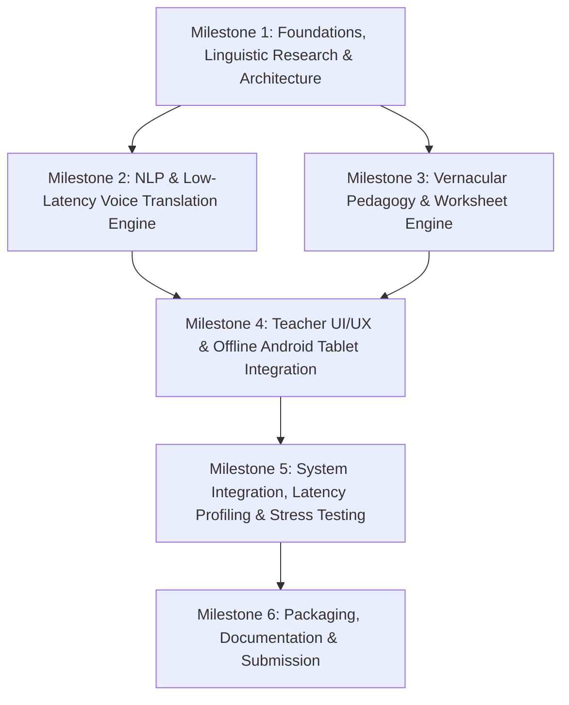

# PalashSaathi: Product Development Roadmap (ROADMAP.md)

**Project:** AI-Powered Vernacular Pedagogy and Real-Time Translation Tool  
**Target Languages:** Hindi (Source) to Tribal Languages — **Santhali (Ol Chiki / Devanagari)**, **Ho (Warang Citi / Devanagari)**, and **Mundari**  
**Core Mission:** Empower non-native primary school teachers to deliver Mother-Tongue-Based Multilingual Education (MTB-MLE) and Foundational Literacy and Numeracy (FLN) curriculum offline on low-end Android hardware.

---

## Executive Summary & Deliverables Matrix

| Metric / Deliverable | Target Specification | Target Milestone |
| :--- | :--- | :--- |
| **Language Pairs** | Hindi -> Santhali (Prototype baseline); Ho & Mundari (Expansion) | Milestone 1, 2, 5 |
| **Voice-to-Voice Latency** | <= 3.0 seconds total round-trip (VAD -> ASR -> MT -> TTS) | Milestone 2, 5 |
| **Classroom Pedagogy** | Auto-generated bilingual worksheets & visual flashcards (FLN Grade 1-3) | Milestone 3 |
| **Hardware Target** | Low-end Android tablet (<= 2 GB RAM, ARMv7/v8, zero internet) | Milestone 4, 5 |
| **Offline Reliability** | 100% offline functionality for local inference, cache, and exports | Milestone 4, 5 |
| **Submission Assets** | Runnable APK / PWA bundle, Technical Docs, Teacher Guide, Demo Video | Milestone 6 |

---

## Roadmap Structure Overview

---

## Milestone 1: Foundations, Linguistic Research & Architecture

> **Objective:** Establish the technical foundation, benchmark linguistic assets for Ho, Mundari, and Santhali, design an ultra-low-latency voice pipeline, and architect an offline edge topology for low-resource tablets.

### Submilestone 1.1: Linguistic Data & Tribal NLP Feasibility Study
- [ ] **Linguistic Asset Audit:** Evaluate available open-source corpora and models (e.g., AI4Bharat IndicTrans2, Bhashini, NLLB-200, HuggingFace tribal datasets) for Santhali, Ho, and Mundari.
- [ ] **Script & Orthography Resolution:**
  - Santhali: Ol Chiki script and Devanagari/Bengali transliteration mapping.
  - Ho: Warang Citi script and Devanagari phonetic representations.
  - Mundari: Devanagari script adaptations.
- [ ] **FLN Domain Vocabulary Extraction:** Compile an essential 500-word Foundational Literacy and Numeracy (FLN) glossary (numbers 1-100, basic arithmetic concepts, primary colors, classroom commands, family terms, common objects).
- [ ] **Feasibility Matrix Report:** Document benchmark BLEU/chrF++ scores, model parameter sizes, and licensing feasibility for offline edge deployment.

### Submilestone 1.2: Low-Latency Voice-to-Voice Pipeline Architecture
- [ ] **Latency Budget Breakdown:** Define strict time allocations for sub-3-second end-to-end translation:
  - Voice Activity Detection (VAD) & Audio Streaming: <= 200 ms
  - Automated Speech Recognition (ASR - Hindi): <= 900 ms
  - Machine Translation (Hindi -> Santhali/Ho/Mundari): <= 700 ms
  - Text-to-Speech Synthesis (TTS - Tribal Target): <= 900 ms
  - Buffer / Playback Overhead: <= 300 ms
- [ ] **Streaming & Chunking Protocol:** Design chunked audio streaming over local WebSockets / IPC pipelines rather than batch file processing to achieve parallelized execution.

### Submilestone 1.3: Offline-First Edge System Architecture Design
- [ ] **Component Interface Specification:** Draft architectural contracts between UI, Audio Engine, Translation Service, and Worksheet Generator.
- [ ] **Edge Runtime Selection:** Benchmark on-device inference engines:
  - ONNX Runtime Mobile / TFLite / ExecuTorch for quantized neural models.
  - WebAssembly (Wasm) + WebGL/WebGPU acceleration fallback for cross-platform hybrid apps.
- [ ] **Fallback Topology:** Design a hybrid mode: cloud-accelerated API when Wi-Fi is present, seamlessly falling back to local quantized models/dictionary lookups when offline.

---

## Milestone 2: Core NLP & Voice Translation Engine Prototype

> **Objective:** Build and optimize the end-to-end speech-to-speech translation pipeline capable of sub-3-second round-trip translation from Hindi to at least one tribal language (Santhali baseline).

### Submilestone 2.1: Machine Translation Engine (Hindi -> Tribal)
- [ ] **Baseline Model Deployment:** Implement and containerize the translation engine using a compact model (e.g., IndicTrans2-1B distilled or quantized NLLB/IndicBART) focusing on Hindi -> Santhali.
- [ ] **Lexicon & Rule-Assisted Fallback:** Develop a rapid exact-match dictionary cache for high-frequency FLN pedagogical terms to bypass neural inference when possible (< 20 ms response).
- [ ] **Ho and Mundari Adaptation Path:** Construct phonetic and transfer-learning rule mappings for secondary prototype language support.

### Submilestone 2.2: Speech-to-Speech (S2S) Pipeline Implementation
- [ ] **Hindi ASR Integration:** Deploy a lightweight Hindi speech-to-text model (e.g., Whisper-Tiny/Base INT8, Sherpa-ONNX, or IndicConformer CTC) with low-latency streaming endpoints.
- [ ] **Tribal TTS Synthesizer:** Implement a lightweight acoustic model and vocoder (e.g., Piper TTS, VITS quantized, or eSpeak-NG with Ol Chiki/phonetic rules) for tribal language speech synthesis.
- [ ] **Audio Pipeline Integration:** Connect ASR -> MT -> TTS into a reactive streaming pipeline with concurrent chunk processing.

### Submilestone 2.3: Model Quantization & Size Optimization
- [ ] **INT8 / Dynamic Quantization:** Quantize ASR, MT, and TTS models to 8-bit precision (INT8/W8A8) to minimize RAM consumption below 1 GB.
- [ ] **Model Pruning & Memory Footprint Reduction:** Strip extraneous language heads and vocabulary tokens to keep total offline package size under 500 MB.

---

## Milestone 3: Vernacular Pedagogy & Bilingual Worksheet Generator

> **Objective:** Develop an automated curriculum generation engine that translates standard Hindi FLN educational materials into structured, printable bilingual classroom worksheets and interactive flashcards.

### Submilestone 3.1: FLN Curriculum Template & Content Engine
- [ ] **Grade 1-3 Curriculum Schemas:** Define structured JSON schemas for foundational educational modules:
  - Numeracy: Counting (1-20, 1-100), simple addition/subtraction, shapes, measurements.
  - Literacy: Phonetics, alphabet matching, rhyming words, simple sentences, object naming.
- [ ] **Pedagogical Phrasebook & Teacher Prompts:** Curate 100+ standard classroom management and pedagogical phrases with audio pronunciation guides (e.g., "Open your notebook", "Repeat after me", "Very good").

### Submilestone 3.2: Automated Bilingual Worksheet Generator
- [ ] **Dual-Column & Parallel Content Layout Engine:** Build an automated generator that pairs Hindi instructions alongside tribal language translations (with phonetic romanization or dual scripts).
- [ ] **Exercise Generator:** Implement modular worksheet exercises:
  - Match-the-following (Hindi word <-> Tribal word <-> Illustration).
  - Fill-in-the-blanks with visual aids.
  - Tracing and handwriting guides for Ol Chiki and Devanagari.
- [ ] **Printable & Shareable Output:** Export high-contrast black-and-white print-ready PDFs and lightweight image formats (A4 format, ink-saver mode for rural school printers).

### Submilestone 3.3: Visual Flashcard & Interactive Aid Generation
- [ ] **Curated Visual Asset Library:** Bundle an offline vector/SVG iconography library covering animals, fruits, household items, body parts, and classroom objects.
- [ ] **Bilingual Digital Flashcards:** Render interactive flashcards in the UI with synchronized target-language audio playback for classroom demonstration.

---

## Milestone 4: Teacher-Centric UI/UX & Low-End Android Tablet Integration

> **Objective:** Build an intuitive, high-performance interface optimized for non-native speaking teachers in rural classroom environments and package it for low-end Android hardware.

### Submilestone 4.1: Classroom-Optimized Touch UI/UX Design
- [ ] **High-Contrast, Large-Touch Interface:** Design UI with large touch targets (>= 48 dp), high-contrast daylight-readable color palettes, and minimal clutter.
- [ ] **One-Tap Push-to-Talk (PTT):** Build a prominent tactile voice translation interface with instant visual feedback (waveform visualizer, state indicators: Listening, Translating, Speaking).
- [ ] **Bilingual Mirror Display:** Show simultaneous side-by-side transcripts (Hindi in Devanagari; Tribal language in native script + phonetic pronunciation aid).

### Submilestone 4.2: Low-End Android Tablet Optimization
- [ ] **RAM & Thread Management:** Cap application peak memory consumption under 1.5 GB to guarantee stable execution on 2 GB RAM tablets without OOM crashes.
- [ ] **Battery & Thermal Throttling Mitigation:** Optimize audio thread lifecycle; turn off microphone polling when idle; implement CPU-friendly wake-locks.
- [ ] **Storage & Cold-Start Optimization:** Compress assets to keep app install footprint minimal; optimize initial startup time to < 3 seconds.

### Submilestone 4.3: Offline Asset Management & Local Persistence
- [ ] **Local Embedded Database:** Implement SQLite/Room/IndexedDB storage for saved worksheets, translation logs, custom vocabularies, and favorite phrases.
- [ ] **Zero-Network Air-Gap Mode:** Ensure all features operate identically without network hardware permissions or active Wi-Fi/cellular connection.

---

## Milestone 5: System Integration, Latency Profiling & Stress Testing

> **Objective:** Integrate all software subsystems, conduct rigorous latency benchmarking against the sub-3-second constraint, and validate pedagogical accuracy.

### Submilestone 5.1: Latency Benchmarking & Performance Profiling
- [ ] **Automated Latency Measurement Harness:** Instrument end-to-end telemetry measuring exact timestamps across:
  1. Speech end detected (VAD).
  2. ASR transcript generation.
  3. MT translation completion.
  4. First audio buffer delivered to speaker (Time to First Audio - TTFA).
- [ ] **Sub-3-Second Enforcement:** Profile and optimize pipeline bottlenecks to guarantee 95th percentile latency <= 3.0 seconds on target hardware.

### Submilestone 5.2: Pedagogical & Linguistic Quality Validation
- [ ] **Classroom Noise Simulation:** Test voice translation accuracy under ambient classroom noise (30-60 dB background chatter, echo).
- [ ] **Pedagogical Correctness Check:** Verify that translated worksheet exercises retain mathematical and semantic correctness in tribal languages.
- [ ] **Teacher Usability Testing:** Evaluate teacher workflow completion times (e.g., generating a worksheet in < 30 seconds, initiating voice translation in < 2 seconds).

### Submilestone 5.3: Field Reliability & Edge Stress Testing
- [ ] **Airplane Mode Soak Testing:** Run continuous translation cycles for 60 minutes in full airplane mode to detect memory leaks or thread deadlocks.
- [ ] **Crash Resilience & Auto-Recovery:** Ensure graceful degradation and rapid process recovery in low-memory situations.

---

## Milestone 6: Deployment, Documentation, Demo & Project Delivery

> **Objective:** Finalize project deliverables, compile user and technical documentation, produce a live demonstration video, and deliver the open-source repository.

### Submilestone 6.1: Technical Documentation & Architecture Manual
- [ ] **Architecture Whitepaper:** Detailed breakdown of model pipelines, offline inference mechanics, and data flow diagrams.
- [ ] **Developer Setup Guide:** Step-by-step instructions for local build, model quantization scripts, and running development environments.
- [ ] **API & Model Reference:** Document interfaces, schemas, and supported language codes.

### Submilestone 6.2: Teacher User Manual & Pedagogical Guide
- [ ] **Illustrated Quick-Start Guide:** One-page visual cheat-sheet for primary school teachers on operating voice translation and printing worksheets.
- [ ] **Classroom MTB-MLE Implementation Guide:** Pedagogical recommendations for incorporating mother-tongue translation during Hindi-medium instruction.

### Submilestone 6.3: Demo Video Production
- [ ] **Classroom Simulation Scenario:** Script and record a realistic teaching demonstration:
  - Non-native teacher speaking Hindi instructions.
  - Sub-3-second voice-to-voice translation in Santhali.
  - Real-time generation and preview of an FLN bilingual worksheet.
  - Complete demonstration conducted in airplane mode (offline).
- [ ] **Video Post-Production:** Add subtitles, latency timer overlays, and feature callouts.

### Submilestone 6.4: Packaging & Repository Finalization
- [ ] **Release Artifacts Build:** Compile standalone APK and release package with bundled offline models.
- [ ] **GitHub Repository Clean-Up:** Complete README.md, license, issue templates, dependency manifests, and automated CI check workflows.
- [ ] **Final Submission Dossier:** Compile project submission form, demo video links, and source code repositories.

---

## 2-Day Rapid Prototype Sprint Alignment (PDR Track)

For rapid hackathon / 2-day delivery cycles, the milestones map directly to the PDR schedule:

| Timeline | Focus Tasks | Milestones Covered | Deliverable Output |
| :--- | :--- | :--- | :--- |
| **Day 1: Morning** | Research, NLP Feasibility, Architecture | Milestone 1 (1.1, 1.2, 1.3) | Feasibility Report & System Architecture Spec |
| **Day 1: Afternoon** | Prototype NLP Engine & Voice Pipeline | Milestone 2 (2.1, 2.2) | Working Hindi -> Santhali Voice/Text Pipeline |
| **Day 1: Evening** | Worksheet Generator Engine | Milestone 3 (3.1, 3.2) | Auto-generated bilingual FLN PDF worksheets |
| **Day 2: Morning** | Teacher UI & Android Tablet Integration | Milestone 4 (4.1, 4.2, 4.3) | Touch-optimized UI running offline on Android |
| **Day 2: Afternoon** | Integration, Latency Optimization (<3s) | Milestone 5 (5.1, 5.2, 5.3) | Sub-3s verified latency benchmark report |
| **Day 2: Evening** | Documentation, Demo Video & Submission | Milestone 6 (6.1, 6.2, 6.3, 6.4) | Demo video, GitHub repository & final release |

---

## Post-Prototype Scaling & Future Roadmap (Beyond 2-Day Prototype)

- **Phase 2 (Field Pilot):** Deploy with 50 primary school teachers across Jharkhand districts (East Singhbhum, Dumka, Ranchi) for in-situ acoustic data collection.
- **Phase 3 (Dialectal & Tribal Expansion):** Expand from Santhali baseline to deep acoustic models for Ho and Mundari dialects, incorporating local folklore and contextual cultural idioms.
- **Phase 4 (Community Crowdsourcing & Fine-Tuning):** Deploy a local community feedback mechanism allowing native speakers to review and refine translations, continuously improving lightweight edge models.
