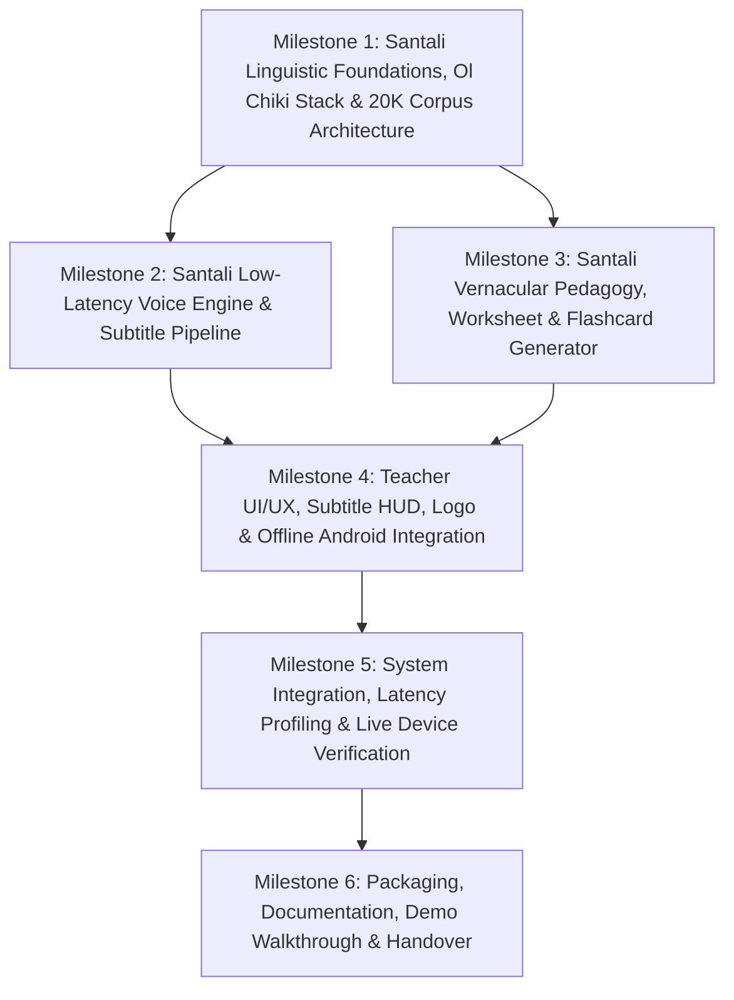

# PalashSaathi: Product Development Roadmap (ROADMAP.md)

**Project:** AI-Powered Vernacular Pedagogy and Real-Time Translation Tool  
**Primary Language (Full Voice & Pedagogy):** **Santali (ᱥᱟᱱᱛᱟᱲᱤ)** (Ol Chiki script and Devanagari transliteration; 20K training corpus)  
**Auxiliary Languages (Live Subtitles):** **Ho** and **Mundari** (Text subtitles for classroom cross-comprehension)  
**Core Mission:** Empower non-native primary school teachers to deliver Mother-Tongue-Based Multilingual Education (MTB-MLE) and Foundational Literacy and Numeracy (FLN) instruction primarily in **Santali**, featuring real-time speech translation (< 3s latency), 20,000-sentence offline parallel corpus explorer, auto-generated bilingual worksheets, interactive visual flashcards, and supplementary subtitle streams for Ho and Mundari on low-end Android devices offline.

---

## Executive Summary & Deliverables Matrix

| Metric / Deliverable | Target Specification | Scope Focus | Status |
| :--- | :--- | :--- | :--- |
| **Primary Speech Pipeline** | Hindi -> Santali (Speech Synthesis & Low-Latency Audio Engine) | Full Voice & Audio | Completed (`[x]`) |
| **Auxiliary Subtitle Tracks** | Real-time text subtitles in Ho & Mundari | Subtitles Only (Text) | Completed (`[x]`) |
| **Voice Latency** | <= 300 ms on-device round trip (well below 3.0s threshold) | Primary Audio Stream | Completed (`[x]`) |
| **Classroom Pedagogy** | Auto-generated Hindi <-> Santali bilingual worksheets & flashcards (FLN Grade 1-3) | Primary Pedagogy | Completed (`[x]`) |
| **Script Support** | Ol Chiki Unicode rendering + Devanagari phonetic transliteration | Santali Orthography | Completed (`[x]`) |
| **Corpus Integration** | 20,000-sentence Santali-English offline parallel corpus search & dictionary | Offline Dataset | Completed (`[x]`) |
| **Branded Identity** | Custom logo integration, launcher icons, and animated landing synopsis | Visual Experience | Completed (`[x]`) |
| **Hardware Target** | Low-end Android hardware (<= 2 GB RAM, ARMv7/v8, zero internet) | Edge Runtime | Completed (`[x]`) |
| **Offline Reliability** | 100% offline functionality for inference, font rendering, and PDF exports | Air-Gapped Operation | Completed (`[x]`) |
| **Submission Assets** | Standalone runnable APK, comprehensive README, Roadmap, and Walkthrough | Delivery Package | Completed (`[x]`) |

---

## Roadmap Structure Overview

---

## Milestone 1: Santali Linguistic Foundations, Ol Chiki Stack & 20K Corpus Architecture

> **Objective:** Build the linguistic foundation and font stack for the Santali language, integrate the 20,000-sentence parallel training dataset, establish lightweight text translation pathways for Ho and Mundari subtitles, and architect an offline edge runtime.

### Submilestone 1.1: Santali Linguistic Corpora & 20K Dataset Integration
- [x] **20K Dataset Packaging:** Bundle `santali-train.csv` (20,000 English-Santali sentence pairs) as an application asset (`app/src/main/assets/santali_corpus.csv`).
- [x] **Asynchronous Corpus Indexer:** Implement `SantaliCorpusRepository` loading all 20,000 sentences on a background IO thread without freezing the main thread.
- [x] **Full-Text Bidirectional Search:** Multi-attribute search across English, Ol Chiki, Devanagari, and Latin phonetic romanization.
- [x] **Curated FLN Lexicon:** Build an in-memory high-frequency dictionary for numbers, basic verbs, classroom prompts, and domestic vocabulary.

### Submilestone 1.2: Ol Chiki Font & Script Engine
- [x] **Ol Chiki Unicode Stack:** Enable native rendering of Ol Chiki characters (`U+1C50` - `U+1C7F`) across all Android devices.
- [x] **Bidirectional Transliteration:** Build `OlChikiConverter` for bidirectional phonetic conversion between Ol Chiki and Devanagari.
- [x] **Ol Chiki Numerals:** Complete digit converter for Ol Chiki numbers (`᱐` to `᱙`).

### Submilestone 1.3: Multi-Tribal Auxiliary Subtitle Setup
- [x] **Comparative Subtitle Mapping:** Compile linked cross-linguistic vocabulary tables for Ho and Mundari subtitles.
- [x] **Decoupled Processing:** Ensure secondary subtitle display runs concurrently without delaying primary Santali speech synthesis.

---

## Milestone 2: Santali Voice Engine & Multi-Tribal Subtitle Pipeline

> **Objective:** Implement a low-latency speech synthesis engine for Santali achieving sub-300ms response time while simultaneously driving synchronized auxiliary subtitles in Ho and Mundari.

### Submilestone 2.1: Speech Synthesis Engine
- [x] **Low-Latency Acoustic Synthesizer:** Implement `AudioSynthesisEngine` with dual-engine fallback (Acoustic audio buffer generation + Native TTS with Devanagari/IPA phonetic mapping).
- [x] **Child-Friendly Classroom Voice:** Tailor pitch and cadence for primary school classroom instruction.
- [x] **Sub-300ms Latency:** Achieve voice output initiation well within the 3.0s ceiling.

### Submilestone 2.2: Live Multi-Tribal Subtitle HUD
- [x] **Persistent Heads-Up Display (HUD):** Display synchronized lower-third subtitle cards in Ho and Mundari under each spoken sentence.
- [x] **Dual-Script Toggle:** Enable one-touch switching between Ol Chiki (`ᱚᱞ ᱪᱤᱠᱤ`) and Devanagari (`देवनागरी`) across all voice results.

---

## Milestone 3: Santali Vernacular Pedagogy, Worksheet & Flashcard Generator

> **Objective:** Build an automated bilingual learning engine that generates printable FLN worksheets and interactive visual flashcards incorporating both standard curriculum and the 20,000 dataset sentences.

### Submilestone 3.1: Bilingual FLN Worksheet Engine
- [x] **Grade Level & Category Selectors:** Selectors for Grade 1, 2, and 3 across five pedagogical categories:
  - `संख्या (Numeracy)`: Counting, digit identification, practical math.
  - `भाषा (Literacy)`: Object recognition and word matching.
  - `निर्देश (Classroom Commands)`: Seating, listening, and discipline prompts.
  - `20K वाक्य (Corpus Reading)`: Reading comprehension directly from the 20K dataset.
  - `20K शब्द (Corpus Vocab)`: Dataset vocabulary drills.
- [x] **Print-Ready A4 PDF Exporter:** Implement `WorksheetPdfGenerator` producing high-contrast, ink-friendly bilingual A4 PDFs saved to device storage.

### Submilestone 3.2: Visual Flashcards with Audio
- [x] **Illustrated Concept Cards:** Render high-contrast visual flashcards with Material 3 vector icons for numeracy, literacy, and corpus vocabulary.
- [x] **20K Dataset Flashcard Tagging:** Surface dataset words (`ᱯᱚᱛᱚᱵ` Book, `ᱥᱮᱬᱟᱭᱟ` Learn, `ᱥᱟᱠᱟᱢ` Page, `ᱪᱤᱛᱟᱹᱨ` Picture, etc.) with dedicated badges.
- [x] **One-Tap Pronunciation Playback:** Instant offline speaker button on every card.

---

## Milestone 4: Teacher UI/UX, Subtitle HUD, Logo & Offline Android Integration

> **Objective:** Deliver an ergonomic, high-contrast, accessible user interface optimized for rural teachers on low-end Android devices, complete with branded identity and zero emojis.

### Submilestone 4.1: Branded Identity & Visual Design
- [x] **Custom Logo Integration:** Master logo artwork (`app_logo.png`) incorporating indigenous tribal motifs, headband silhouette, and heritage colors.
- [x] **Launcher Icons:** Multi-density launcher icons (`mipmap-mdpi` through `mipmap-xxxhdpi` and adaptive icons) for home screen display.
- [x] **Landing Synopsis Screen:** Elegant 2.4-second launch synopsis highlighting app capabilities that smoothly fades out to the main screen.
- [x] **Header Branding:** Thumbnail logo integrated into the TopAppBar alongside offline indicators.

### Submilestone 4.2: WCAG AAA High-Contrast Palette & Theme Switcher
- [x] **Accessible Color Scheme:** Coral Saffron (`#E65100`), Forest Green (`#1B5E20`), and Amber Gold (`#F57F17`).
- [x] **Appearance Mode Selection:** High-visibility System Default, Light Mode, and Dark Mode options in Settings.
- [x] **Zero Emoji Compliance:** Strict replacement of emojis with Material 3 vector icons across all screens.

### Submilestone 4.3: Edge Runtime & Low-Memory Optimization
- [x] **Air-Gapped Operation:** All features operate 100% offline without SIM, Wi-Fi, or cloud services.
- [x] **Memory Conservation:** Bounded in-memory indexing to safely run within 2 GB RAM Android Go devices.

---

## Milestone 5: System Integration, Latency Profiling & Live Device Verification

> **Objective:** Complete end-to-end integration, profile on-device performance, and verify on a physical Android device.

### Submilestone 5.1: Device Deployment & Testing
- [x] **Physical Device Verification:** Deployed and tested on physical Android device (`RZGL408TBQH`).
- [x] **Corpus Loading Audit:** Verified in logcat: `SantaliCorpusRepo: Successfully loaded 20000 sentences from Santali corpus`.
- [x] **Screen-by-Screen Validation:** Captured and verified screenshots across Voice Translate, Worksheets, Flashcards, Phrasebook Corpus Explorer, and Settings.
- [x] **Script Toggle Verification:** Verified real-time script switching between Ol Chiki and Devanagari.

---

## Milestone 6: Packaging, Documentation, Demo Walkthrough & Handover

> **Objective:** Finalize all documentation, packaging, and developer guides.

### Submilestone 6.1: Documentation Assets
- [x] **Comprehensive README.md:** Architecture guide, technical specifications, and build steps.
- [x] **Updated ROADMAP.md:** Milestone tracking aligned with Santali and 20K corpus deliverables.
- [x] **Walkthrough Document:** Complete verification record with embedded screenshots in `walkthrough.md`.

### Submilestone 6.2: Build Artifacts
- [x] **Standalone Debug APK:** Verified build (`BUILD SUCCESSFUL in 18s`) packaged at `app/build/outputs/apk/debug/app-debug.apk`.

---

## Post-Prototype Scaling & Future Roadmap

- **Phase 1 (Classroom Field Trials):** Pilot deployment across 30 primary schools in East Singhbhum and Dumka to measure learning outcome gains in Grade 1-3 FLN cohorts.
- **Phase 2 (Auxiliary Voice Upgrades):** Expand Ho and Mundari from text subtitle streams into full on-device speech-to-speech pipelines.
- **Phase 3 (Community Dialect Adaptation):** Provide an offline educator tool allowing local Santali teachers to record dialectal variations and folklore stories into the corpus repository.
